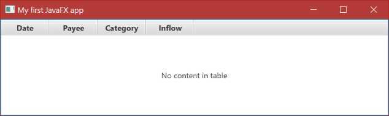
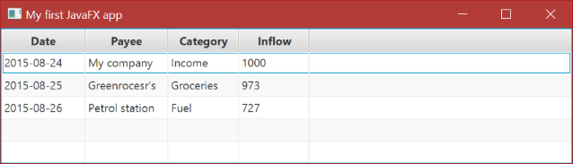

## Wzorce projektowe dla interfejsu graficznego cz.1

Celem zajęć będzie przybliżenie podstawowych wzorców projektowych stosowanych podczas rozwoju graficznego interfejsu. Na warsztat weźmiemy technologię JavaFX8 (wbudowaną w nową wersję standardowej maszyny Javy), w która posiada wiele wbudowanych mechanizmów wspomagających budowanie przejrzystego kodu. Nie będziemy jednak skupiać się na technologii, ale raczej na zrozumieniu podstawowych wzorców oraz umiejętności ich stosowania.

Na zajęciach poznamy:

 - podstawową implementację wzorca MVC
 - zasadę działania i sposoby wykorzystania mechanizmu właściwości
 - zastosowanie wzorca Obserwator

W celu zminimalizowania bariery technologicznej zachęcamy do zapoznania się z podstawami technologii JavaFX oraz elementów Java 8 (m.in. lambdy).

1. [Java 8 API](http://docs.oracle.com/javase/8/docs/api/) - JavaDoc dla standardowych klas Java8
2. [JavaFX 8 API](http://docs.oracle.com/javase/8/javafx/api/) - JavaDoc dla klas JavaFX8
3. [Oracle JavaFX Tutorials](http://docs.oracle.com/javase/8/javafx/get-started-tutorial/get_start_apps.htm) -  Oficjalny tutorial dla JavaFX przygotowany przez Oracle

### Konspekt

#### Wprowadzenie

1. Zaimportuj projekt *to-javafx-1* do Eclipse'a
  - Wybierz opcję: *File -> Import... -> General -> Existing Projects into Workspace*
  - Wybierz katalog to-javafx-1
2. Zapoznaj się z elementami przykładowej aplikacji:
  - Model danych o transakcjach na koncie bankowym (pakiet `pl.edu.agh.iisg.to.javafx.cw1.model`)
  - Generator przykładowych danych (klasa `pl.edu.agh.iisg.to.javafx.cw1.model.generator.DataGenerator`)
  - Stub widoku (plik `pl.edu.agh.iisg.to.javafx.cw1.view.AccountOverviewPane.fxml`)

Będziemy tworzyć GUI zgodnie z uznanymi wzorcami jakimi są Model-View-Controler (MVC) czy (później) Model-View-Presenter (MVP). Struktura pakietów w projekcie wprowadza od razu podział zgodny z w/w wzrocami.

- `pl.edu.agh.iisg.to.javafx.controller` - zawiera klasy kontrolerów związanych z logiką biznesową (na razie pusty)
- `pl.edu.agh.iisg.to.javafx.model` - zawiera klasy modelu
- `pl.edu.agh.iisg.to.javafx.view` - zawiera widoki wraz z powiązanymi (jeden-do-jeden) kontrolerami


**Uwaga:** Pakiet widoku (*view*) zawiera kontrolery związane bezpośrednio z pojedynczymi widokami. Dlaczego? O tym później.

#### Uruchomienie aplikacji JavaFX

Jak w każdym programie Java, aby uruchomić aplikację potrzebna jest klasa Main. Potrzebujemy stworzyć klasę `Main`, która wystaruje naszą aplikację wyświetlając gotowy widok `AccountOverviewPane.fxml`.  Klasa startowa w aplikacja JavaFX powinna rozszerzać klasę `javafx.application.Application`, dlatego aby ułatwić zadanie skorzystamy z gotowego kreatora dostepnego w Eclipse'ie.

1. Przygotowana klasa `Main` znajduje się w pakiecie `pl.edu.agh.iisg.to.javafx.cw1`

	**Komentarz** Najważniejszym elementem klasy startowej jest metoda `start`, która jest wołana automatycznie przy uruchomieniu metody `launch`. Metoda `start` przyjmuje jako parametr scenę (`Stage`), na której będziemy rozmieszczać wszystkie kontrolki UI.  Więcej na temat sceny i struktury elementów UI w JavaFX znajdziesz na stronie [Working with JavaFX Scene Graph](http://docs.oracle.com/javase/8/javafx/scene-graph-tutorial/scenegraph.htm)

2. Uruchom klasę klasę `Main`: PPM na klasie `Main` -> *Run as* -> *Java Application*


#### Dostowanie modelu danych

Model naszej przykładowej aplikacji musi zostać zmodyfikowanych tak, aby w prosty sposób synchronizować jego stan z informacjami wyświetlanymi na ekranie. W tym celu JavaFX wprowadza właściwości, które posiadają wbudowane mechanizmy notyfikacji o zmianach swoich wartości. Więcej na ten temat znajdziesz na stronie [Using JavaFX Properties and Binding](https://docs.oracle.com/javafx/2/binding/jfxpub-binding.htm).

**Pytania/polecenia**:
1. Jakie metody definiuje interfejs `Property`?
2. Wyjaśnij zasadę działania mechanizmu właściwości w JavaFX.

Dla potrzeb naszej prostej aplikacji, konieczne będzie opakowanie atrybutów obiektów modelu we właściwości odpowidniego typu. W tym celu: 

1. Otwórz klasę `Transaction`
2. Opakuj atrubut `private String payee` we właściwość `StringProperty`
```java
	public class Transaction {
        private StringProperty payee;

        public Transaction(..., String payee, ...) {
            this.payee = new SimpleStringProperty(payee);

        }

        public final String getPayee() {
            return payee.get();
        }

        public final void setPayee(String payee) {
            this.payee.set(payee);
        }

        public final StringProperty getPayeeProperty() {
            return payee;
        }
	}
``` 
**Komentarz:** Zwróć uwagę na dodatkową metodę `getPayeeProperty`, która zwraca obiekt właściwości (`Property`). Metoda ta będzie istotna przy rejestracji obserwatorów na obiektach modelu (ale o tym później).
**Uwaga:** API modelu (w tym przypadku klasy `Transaction`) nie powinno się zmienić. Sprawdź czy klasa `DataGenerator`, która tworzy przykładowe obiekty modelu, nadal się kompiluje.
5. Wykonaj analogiczne operacje dla pozostałych atrybutów klasy `Transaction` wykorzustując interfejs `ObjectProperty<Type>` oraz jego domyślną implementację `SimpleObjectProperty<Type>`, gdzie `Type` oznacza typ oryginalnego atrybutu. Nie zapomnij o metodach `get*Property` :)
6. Upewnij się u prowadzącego, że Twój model wygląda poprawnie.


#### Utworzenie kontrolera dla głównego widoku

Mając gotowy model oraz widok przychodzi czas na **kontroler**. Dla każdego widoku tworzymy dedykowany kontroler, który będzie odpowiadał za ustawienie danych wejściowych oraz zdefiniowania mapowania pomiędzy elementami modelu a komponentami widoku, które pozwoli na bezpośrednią synchronizację modelu i widoku.

Dodamy teraz kontroler dla widoku `AccountOverviewPane.fxml` i połączymy go z modelem:
1. Utwórz nową klasę `AccountOverviewController` w tym samym pakiecie co widok (plik fxml).

	**Komentarz:** Niestety *Scene Builder* "nie widzi" kontrolerów, które znajdują się w innych pakietach, co utrudnia pracę z tym narzędziem. Dlatego kontrolery dedykowane widokom umieszczamy w tym samym pakiecie co widoki. Jak już opanujemy podstawy JavaFX i w mniejszym stopniu będziemy wykorzystywać *Scene Buildera*, kontrolery będą mogły lądować w osobnych pakietach.

	**Uwaga:** Kontroler jest zwykłą klasą POJO, nie dziedziczy z żadnej klasy JavaFX.
2. Kontroler będzie odpowiedzialny za wyświetlenie wszystkich transakcji jakie mamy na danym koncie, a więc zdefiniujemy w nim atrybut:
```java
private Account data;
```
3. Ponadto dla każdego istotnego elementu widoku (kontrolki), w którym będziemy chcieli wyświetlić dane musimy zdefiniować odpowiedni atrybut w kontrolera. W naszym przypadku będą to:
```java
    public class AccountOverviewController {

	private Account data;

        @FXML
        private TableView<Transaction> transactionsTable;

        @FXML
        private TableColumn<Transaction, LocalDate> dateColumn;

        @FXML
        private TableColumn<Transaction, String> payeeColumn;

        @FXML
        private TableColumn<Transaction, Category> categoryColumn;

        @FXML
        private TableColumn<Transaction, BigInteger> inflowColumn;
        
        @FXML
		private void initialize(){
			...
		}
    }
```
**Uwaga:** Zauważ, że w typie generycznym tabeli jest typ `Transaction`. Dlaczego? 
**Komentarz:** Prywatne pola i metody, które mają być dostępne z poziomu plików fxml muszą być poprzedzone adnotacją `@FXML`. Dobrym zwyczajem jest, aby wszystkie elementy klasy dostępne w plikach fxml były oznaczane w taki sposób - zwiększa to czytelność kodu.


#### Połączenie kontrolera z widokiem

Ustaw kontroler dla naszego widoku i połacz atrybuty kontrolera z odpowiadającymi im kontrolkami w widoku. W tym celu:

1. Otwórz plik `AccountOverviewPane.fxml`
2. Do głównego komponentu widoku `AccountOverviewPane` dodaj atrybut `fx:controller`, który wskazuje na  klasę kontrolera `AccountOverviewController`:
```xml
<BorderPane ... fx:controller="pl.edu.agh.iisg.to.javafx.cw1.view.AccountOverviewController">
  ...
</BorderPane>
```
3. Przyporządkuj widok tabeli do odpowiedniego pola w kontrolerze, wykorzystaj w tym celu atrybut `fx:id`:
```xml
<TableView fx:id="transactionsTable" ...>
  ...
</TableView>
```
4. W analogiczny sposób przyporządkuj poszczególne kolumny do odpowiednich pól w kontrolerze.
5. Zapisz plik `AccountOverviewPane.fxml`.

#### Połączenie kontrolera z modelem

Kolejnym krokiem jest skojarzenie elementów modelu z atrybutami kontrolera. Operację to wykonujemy podczas inicjalizacji kontrolera, w metodzie `initialize`. Dla każdej kolumny ustawiamy `CellValueFactory`, które będzie odpowiedzialne za dostarczenie wartości dla danego elementu modelu. Innymi słowy fabryka ta otrzymując na wejściu obiekt typu `Transaction` powinna "wyłuskać" z niego wartość odpowiadającą danej kolumnie.

1. Otwórz klasę `AccountOverviewController`
2. W metodzie `initialize` dla każdej kolumny ustaw `CellValueFactory`
```java
	@FXML
	private void initialize(){
		dateColumn.setCellValueFactory(dataValue -> dataValue.getValue().getDateProperty());
		payeeColumn.setCellValueFactory(dataValue -> dataValue.getValue().getPayeeProperty());
		categoryColumn.setCellValueFactory(dataValue -> dataValue.getValue().getCategoryProperty());
		inflowColumn.setCellValueFactory(dataValue -> dataValue.getValue().getInflowProperty());
	}
```

**Komentarz:**
1. Metoda `initilize()` jest automatyczne wołana po załadowaniu pliku fxml. Przed jej wywołaniem, wszystkie pola oznaczone adnotacją `@FXML` powinny być zainicjalizowane.
2. Metoda `setCellValueFactory(...)` wywoływana na poszczególnych kolumnach tabeli, ustawia skojarzenie pomiędzy kolumną a poszczególnymi atrybutami modelu (obiektami typu `Transaction`).


#### Konfiguracja kontrolera w głównej klasie aplikacji

Ostatniem krokiem na drodze do działającej aplikacji jest odpowiednia konfiguracja kontrolera w głównej klasie aplikacji tak, aby wyświetlał przykładowe dane. 

1. Na razie nasz kontroler nie pozwala na ustawienia danych (`Account`), musimy więc dodać *setter*, który ustawi dane w kontrolerze oraz wywoła przeładowanie widoku:
```java
	public void setData(Account acccount) {
		this.data = acccount;
		transactionsTable.getItems().setAll(acccount.getTransactions());
	}
```
2. Teraz możemy w głównej klasie ustawić dane początkowe z wykorzystaniem dostarczonego generatora danych:
```java
	private void initRootLayout() {
        try {
            // load layout from FXML file
            FXMLLoader loader = new FXMLLoader();
            loader.setLocation(Main.class.getResource("view/AccountOverviewPane.fxml"));
            BorderPane rootLayout = (BorderPane) loader.load();

            // set initial data into controller
            AccountOverviewController controller = (AccountOverviewController)loader.getController();
            controller.setData(DataGenerator.generateAccountData());
                        
			// add layout to a scene and show them all
            Scene scene = new Scene(rootLayout);
            primaryStage.setScene(scene);
            primaryStage.show();
            
        } catch (IOException e) {
            // don't do this in common apps
            e.printStackTrace();
        }
    }
```
3. Uruchom aplikację, która powinna wyglądać tak:



### Obsługa selekcji - usuwanie elementów z tabeli

Teraz naszym celem będzie dodanie opcji usuwania zaznaczonych wierszy z tabeli za pomocą przycisku.

#### Dodanie przycisku *Delete* do widoku aplikacji


1. Otwórz plik *AccountOverviewPane.fxml* 
2. Poniżej tagu `center` dodaj przycisk *Delete*: 
```xml
 <right>
      <VBox alignment="TOP_CENTER" prefHeight="200.0" prefWidth="150.0" BorderPane.alignment="CENTER">
         <opaqueInsets>
            <Insets bottom="5.0" left="5.0" right="5.0" top="5.0" />
         </opaqueInsets>
         <children>
            <Button alignment="TOP_CENTER" maxWidth="1.8" mnemonicParsing="false" text="Delete">
               <VBox.margin>
                  <Insets bottom="5.0" left="5.0" right="5.0" top="5.0" />
               </VBox.margin></Button>
         </children>
         <BorderPane.margin>
            <Insets bottom="5.0" left="5.0" right="5.0" top="5.0" />
         </BorderPane.margin>
      </VBox>
   </right>
```

3. Dodaj również brakującą instrukcję importu (potrzebna dla klasy Insets):
```xml
<?import javafx.geometry.*?>
```

#### Obsługa przycisku w kontrolerze

1. Otwórz w Eclipse'ie klasę `AccountOverviewController`
2. Dodaj metodę obsługująca zdarzenie naciśnięcia przycisku
```java
	@FXML
	private void handleDeleteAction(ActionEvent event) {
		data.getTransactions().removeAll(transactionsTable.getSelectionModel().getSelectedItems());
	}
```

**Komentarz:** Metoda ta pobiera i usuwa wszystkie elementy tabeli, które są aktualnie zaznaczone. 
2. Dodaj atrybut reprezentujący przycisk
```java
	@FXML
	private Button deleteButton;
```
3. W metodzie inicjalizacji kontrolera dodaj kod, który wyłączy przycisk, jeśli zaznaczenie w tabeli będzie puste.
```java
deleteButton.disableProperty().bind(Bindings.isEmpty(transactionsTable.getSelectionModel().getSelectedItems()));
```
**Polecenie:** Wyjaśnij zasadę działania powyższego kodu.
4. Zapisz klasę kontrolera


#### Skojarzenie widoku przycisku z kontrolerem

1. Otwórz ponownie plik *AccountOverviewPane.fxml*
2. Ustaw atrybuty `fx:id` i `onAction` dla przycisku do usuwania transakcji, tak jak przedstawia poniższy fragment kodu:
```xml
<Button fx:id="deleteButton" ... onAction="#handleDeleteAction" text="Delete">
...
</Button>
```
3. Uruchom aplikację i przetestuj działanie przycisku *Delete*


**Polecenie:** Wyjaśnij za co odpowiadają w/w atrybuty?
4. Zapisz i zamknij *Scene Buildera*
5. Odśwież kod projektu w Eclipse'ie i uruchom aplikację. Przetestuj działanie przycisku *Delete*
6. Czy wszystko działa poprawnie? Przyjrzyj się klasie modelu `Account` i sposobie połączenia listy transakcji z widokiem i zastanów się, co należałoby zrobić, żeby naprawić ten problem.


